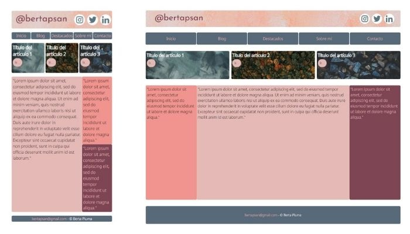

# IT-Academy - PHP-M2 Tasca

This is my solution to the Sprint 2 requested task.

## Table of contents

- [Overview](#overview)
  - [The challenge](#the-challenge)
  - [Screenshot](#screenshot)
  - [Links](#links)
- [My process](#my-process)
  - [Built with](#built-with)
  - [What I learned](#what-i-learned)
  - [Continued development](#continued-development)
  - [Useful resources](#useful-resources)
- [Author](#author)
- [Acknowledgments](#acknowledgments)

## Overview

### The challenge

- Replicate provided wireframe structure
- Generate media resources
- View the optimal layout for the site depending on their device's screen size
- Include Header and Footer as PHP files

### Screenshot



### Links

- [Solution URL](http://bertapluma.atwebpages.com/PHP-M2/)

## My process

### Built with

- Semantic HTML5 markup
- Sass (variables, reset and mixins)
- CSS Flexbox
- Mobile-first workflow
- PHP

### What I learned

Highlights:

```Sass
Sass
Variables
Mixins
Media Queries
```

```php
Header and Footer using PHP
```

### Continued development

I want to continue working on code optimization and acquire knowledge to add testing to my projects.

### Useful resources

- [CSS-tricks](https://css-tricks.com/snippets/css/a-guide-to-flexbox/) - This helped me to understand flexbox container/items properties.
- [Color Palettes generator](https://colorhunt.co/) - Really usefull free website to create your color palette.
- [Online Image Editor](https://www.photopea.com/) - Amazing free website "similar" to Photoshop.
- [Free Web Hosting](https://www.awardspace.com/) - Nice free website to host and puvblish your projects.

## Author

- Website - [Bertapsan - My github](https://github.com/bertapsan)
- Linkedin - [Berta Pluma](https://www.linkedin.com/in/bertaplumasanjurjo/)
- Twitter - [@yourusername](https://twitter.com/BertaPSan)

## Acknowledgments

A special mention to Nancy Espinosa my IT-Academy mentor.
